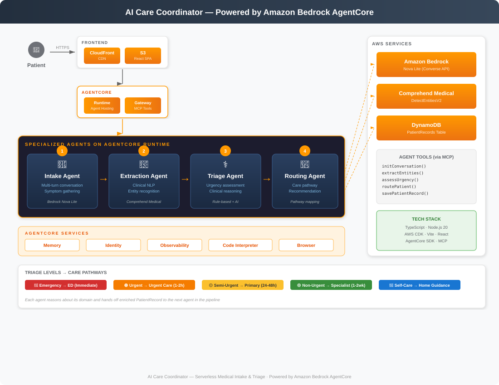

# AI Care Coordinator

An AI-powered patient intake and triage system built on AWS, demonstrating how intelligent automation can reduce administrative burden and accelerate time-to-care in healthcare settings.



---

## The Problem

Regional health systems face surges in patient volume that overwhelm manual intake processes. Today, front-desk staff and triage nurses manually collect symptoms through phone calls or paper forms, cross-reference clinical guidelines, and make routing decisions — a process that takes 15–30 minutes per patient and varies in consistency from one clinician to the next.

When patient volume spikes (flu season, regional events, post-holiday surges), processing times balloon, wait times increase, and patients with urgent needs risk being lost in the queue. Staff spend more time on administrative data gathering than on clinical judgment.

To reduce intake time and improve triage consistency, health systems need to automate routine symptom collection, ensure every patient is evaluated against the same clinical guidelines, and route complex cases to human clinicians with the context they need to act fast.

---

## Our Solution

### Conversational Patient Intake
- Natural language symptom collection through a chat interface — no complex forms
- Multi-turn conversations that ask relevant follow-up questions (onset, duration, severity)
- Real-time clinical entity extraction that structures free-text into standardized medical data

### AI-Powered Triage
- Amazon Bedrock (Nova Lite) conducts empathetic, medically-informed conversations with patients
- Amazon Comprehend Medical extracts structured clinical entities (symptoms, conditions, medications, anatomy) with ICD-10 and RxNorm codes
- Rule-based triage engine evaluates extracted data against clinical guidelines to assign urgency levels
- Provides explainable reasoning so clinicians understand *why* a patient was triaged at a given level

---

## Use Case: Automated Patient Intake & Triage

### Persona: Patient (Marcus Chen)

Marcus is experiencing chest tightness and shortness of breath after climbing stairs. Rather than waiting on hold or filling out a paper form at the clinic, he opens the AI Care Coordinator from his phone.

**Symptom Reporting:**
- Describes symptoms in plain language through the chat interface
- Answers follow-up questions about onset, duration, and severity
- Confirms a summary of collected information before proceeding

**Receiving Care Guidance:**
- Gets an immediate urgency assessment with clear reasoning
- Receives routing to the appropriate care pathway (Emergency, Urgent Care, Primary Care, Specialist, or Self-Care)
- Sees estimated wait times and next steps


## Architecture

The system is built as a serverless pipeline on AWS, with four specialized stages:

| Stage | Component | AWS Service | Purpose |
|-------|-----------|-------------|---------|
| 1 | Intake Agent | Amazon Bedrock (Nova Lite) | Multi-turn conversational symptom gathering |
| 2 | Extraction Agent | Amazon Comprehend Medical | Clinical NLP and entity recognition |
| 3 | Triage Agent | Rule Engine | Urgency assessment against clinical guidelines |
| 4 | Routing Agent | AWS Lambda | Care pathway recommendation |

### Infrastructure
- **Frontend**: React SPA served via CloudFront + S3
- **API**: HTTP API Gateway → Lambda
- **Persistence**: DynamoDB (PatientRecords table)
- **IaC**: AWS CDK (TypeScript)

### Triage Levels → Care Pathways

| Urgency | Pathway | Response Time |
|---------|---------|---------------|
| 🔴 Emergency | Emergency Department | Immediate |
| 🟠 Urgent | Urgent Care Clinic | 1–2 hours |
| 🟡 Semi-Urgent | Primary Care Appointment | 24–48 hours |
| 🟢 Non-Urgent | Specialist Referral | 1–2 weeks |
| 🔵 Self-Care | Home Guidance | Self-directed |

---

## Tech Stack

- **Language**: TypeScript (full stack)
- **Runtime**: Node.js 20
- **Frontend**: React + Vite
- **Infrastructure**: AWS CDK
- **AI/ML**: Amazon Bedrock (Nova Lite), Amazon Comprehend Medical
- **Testing**: Vitest + fast-check (property-based testing)

---

## Project Structure

```
├── packages/
│   ├── shared/          # Shared types and serialization
│   ├── backend/         # Lambda handler, pipeline stages
│   └── frontend/        # React dashboard
├── infra/               # AWS CDK infrastructure
├── scripts/             # Build and deploy scripts
├── icons/               # AWS service icons
└── .kiro/specs/         # Kiro spec documents (requirements, design, tasks)
```

---

## Getting Started

### Prerequisites
- Node.js 20+
- AWS CLI configured with appropriate credentials
- AWS CDK CLI (`npm install -g aws-cdk`)

### Install Dependencies
```bash
npm install
```

### Run Tests
```bash
npm test
```

### Build
```bash
npm run build
```

### Deploy
```bash
npm run deploy
```


## License

This project is provided as a demo/reference implementation.
